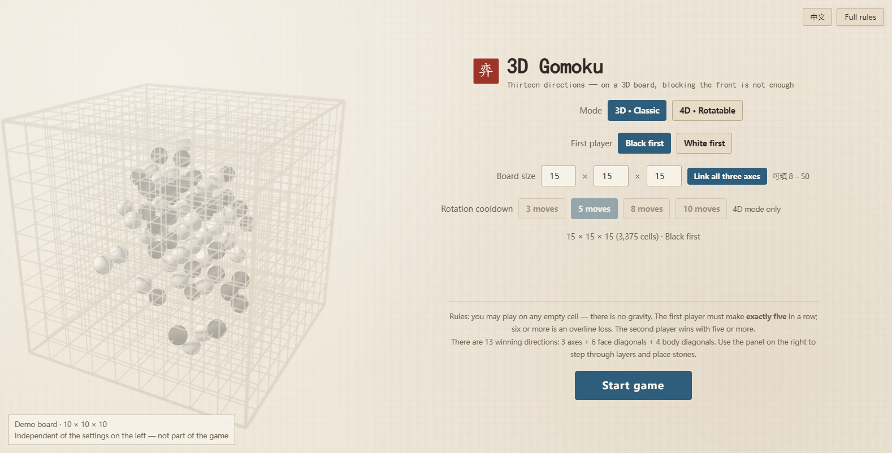

# gomoku-3d-4d

[中文](README.md) | **English**

**3D & 4D Gomoku** — one HTML file, double-click to play, zero dependencies.
*三维与四维五子棋 —— 单文件网页版，双击即玩，零依赖。*

[](https://awua-dcm.github.io/gomoku-3d-4d/)
[](Web_Gomoku3D/index.html)
[](_verify/run-all.sh)
[](LICENSE)

The online demo serves the very same `index.html` that is in this repository, hosted on
GitHub Pages — there is no build step, and the deployed file is the file you can double-click.

The game's interface switches between six languages too — the button in the top-right corner
opens the list. It starts in Chinese.



---

## 🎯 What this is

Gomoku (five-in-a-row) played on an **N×N×N board**. The big difference from the flat game
is that there are far more ways to line stones up — **13 directions** in all (3 axes +
6 face diagonals + 4 body diagonals). Blocking the front is not enough: a line can cut
diagonally, run straight up through the layers, or thread several layers at once.

Three things you don't see every day:

| | |
|---|---|
| **4D mode** | A layer can be **rotated like a Rubik's cube**. Once every few moves you may rotate one layer, and every stone in it moves with it — a threat you set up two moves ago can be rotated right out from under you |
| **Rectangular boards** | In 3D mode the three axes may have different lengths (say `8 × 12 × 30`). Each axis accepts `8 – 50` |
| **The first player is restricted** | The first player must make **exactly five in a row**; six or more is an **overline loss**. The second player wins with five or more. The reason is that on a 3D board the first player's advantage is otherwise overwhelming — see the [full rules](Web_Gomoku3D/RULES_SPEC.en.md) |

---

## 🕹️ How to play

**Double-click `Web_Gomoku3D/index.html`** and it opens in any modern browser.

No server, no network, nothing to install.
To confirm nothing is broken: press `F12` → Console and look for red text.

### ⌨️ Controls

| Action | What it does |
|---|---|
| Drag with the left button | Rotate the board. Left/right turns forever; dragging up/down **all the way gives you a true top-down or bottom-up view** (89.5°). **The board follows your finger**: drag down to look at the top face |
| Scroll wheel | Zoom |
| Click | Place a stone on the current layer |
| Hover | Red lines mark the x / y / z lines through the cell under the cursor |
| Right-hand panel | Step through the board layer by layer; click an empty cell to play there |
| **Grid lines** button, top-left | Hide the 3D lattice so only the stones remain. The blue current-layer frame, the red hover lines and the gold winning line all stay — hide those and you cannot aim |
| End-of-game banner | Can be **dragged** (it cannot leave the left-hand view), and closed with **Close Esc** or the Esc key. Closing it does not let you play on: to continue the same game you must press **Undo** |
| `Z` / `R` / `G` | Undo / Restart / Toggle the view mode (ghost layers ↔ slice) |
| `H` | Hide / show the grid lines (same as the top-left button) |
| `Q` `E` or `[` `]` | Change the current layer |
| `T` / `Y` | (4D) Rotate a layer / undo that rotation |
| Touch: pinch in / out | Zoom the board. **Works on both the 3D board and the single-layer board** (on a phone a cell of the layer board is only about 10px across, so zooming is the only way to aim) |
| Touch: two-finger drag | Pan the board — it follows your fingers |
| Language button, top-right | Opens a list of the six languages (中文 / English / 日本語 / 한국어 / Русский / Français); the current one is highlighted |
| Touch: double-tap a board | Reset — the 3D board returns to its start framing, the layer board to 1×, pan cleared. **The angle you rotated to is left alone** |

> While zoomed in, a single tap places its stone after a ~300ms double-tap window.
> **At 1× with no panning there is no such delay** — placing is as immediate as it always was.

The **Full rules** button in the top-right corner opens the complete rule text.

---

## 🧪 Running the tests

```bash
bash _verify/run-all.sh
```

**All you need is node** — no Unity, no .NET, no npm packages. Eight steps; expected result:

```
11733 + 19408 + 98 + 94 + 8845 + 115 + 248 = 40541 assertions, all green
```

Step 8 (a real headless-browser check) is optional: if Chrome or Edge isn't installed it is
skipped rather than failed. It also writes screenshots to `_verify/shots/`.

To run one piece on its own:

| Command | Count | What it covers |
|---|---|---|
| `node Web_Gomoku3D/tests/rules.test.mjs` | 11733 | 3D rule baseline (replays frozen vectors) |
| `node Web_Gomoku3D/tests/rotation.test.mjs` | 19408 | 4D rotation consistency |
| `node Web_Gomoku3D/tests/dims.test.mjs` | 98 | Rectangular boards + size constraints |
| `node Web_Gomoku3D/tests/dom-smoke.test.mjs` | 94 | UI against a DOM stub (includes the language switch, gesture and reset edge cases, drag-direction convention) |
| `node Web_Gomoku3D/tests/online.test.mjs` | 8845 | Networking kernel, cell-by-cell against the web build (1156 cases) |
| `node Web_Gomoku3D/tests/online-http.test.mjs` | 115 | Networking HTTP layer (loopback) |
| `node _verify/browser-check.mjs` | 248 | Real browser (GLSL compilation, layout geometry, console errors, English layout, synthesized multi-touch) |

The two networking tests run inside step 7 and **cannot be skipped**.

Three more scripts exist to prove the checks above actually fail when they should —
each deliberately breaks the code and requires that the tests catch every case:

| Command | What it does |
|---|---|
| `python _verify/inject-rulenote.py` | Breaks the on-screen rule summary 3 ways; both suites must catch 3/3 |
| `python _verify/inject-i18n.py` | Breaks the language handling 8 ways (a missing translation in each of the three tables, a broken switch-back to Chinese, an unhighlighted list, a plural form that never changes…) and names, per case, which suite has to catch it |
| `node _verify/inject-online.mjs` | Breaks the networking code 25 ways; every case must turn a test red (slow, not part of `run-all.sh`) |

> The first two temporarily break `index.html` and restore it in a `finally` block.
> They run `browser-check` against a scratch directory, so the six baseline PNGs in
> `_verify/shots/` are never overwritten: screenshots are taken *before* the failures are
> reported, so writing to the default directory would put captures of a deliberately broken
> page into version control — after which `git status` can no longer tell "the image went
> stale" from "the UI really changed".

(One caveat: the assertion total above is hard-coded, so it always lags a little behind.
The real total is whatever `bash _verify/run-all.sh` prints.)

### 🔒 About the "frozen vectors"

`tests/vectors.json` and `tests/rotation-vectors.json` were **exported from a C# kernel
that has since been deleted**. The export script and the C# source are both gone. That means:

> **Those two files can never be regenerated.**

Step 2 of `run-all.sh` pins them by md5. Editing them to make a test go green
**is not fixing a bug, it is tampering with evidence**. What they mean today is
"this implementation agrees move-for-move with the C# one as of 2026-09" — a **frozen
historical baseline**, not a comparison against something still alive.
See the header of [`_verify/run-all.sh`](_verify/run-all.sh) for the full story.

---

## 📁 Repository layout

```
.
├── README.md                   ← the Chinese README (this file is README.en.md)
├── Web_Gomoku3D/
│   ├── index.html              ← all the code. 3D/4D rendering + rule kernel + UI, one file, no dependencies
│   ├── server.js               ← the networking server (zero dependencies). Protocol and tests are in place; the page is not wired to it yet
│   ├── README.md               ← engineering notes: architecture, evidence boundaries, known limits (Chinese only — much deeper than this file)
│   ├── RULES_SPEC.md           ← full rules, for players (Chinese). This is what "Full rules" shows
│   ├── RULES_SPEC.en.md        ← the rules in English / Japanese / Korean / Russian / French:
│   ├── RULES_SPEC.ja.md        ←   picking a language shows that language's copy
│   ├── RULES_SPEC.ko.md
│   ├── RULES_SPEC.ru.md
│   ├── RULES_SPEC.fr.md
│   ├── ONLINE.md               ← design for two-player networking (Chinese only)
│   └── tests/                  ← offline tests + the two frozen vector files
├── _verify/
│   ├── run-all.sh              ← one command runs every offline check
│   ├── browser-check.mjs       ← headless Chrome/Edge: GLSL, console, layout geometry, screenshots
│   ├── embed-rules.mjs         ← generator that embeds all six RULES_SPEC files into index.html
│   ├── inject-rulenote.py      ← injection check: proves the rule-summary assertions can fail
│   ├── inject-i18n.py          ← injection check: proves the language-switch assertions can fail
│   ├── inject-online.mjs       ← injection check: proves the networking assertions can fail (slow, 25 cases)
│   └── shots/                  ← screenshots written by browser-check
├── 打开流程.md                  ← setup walkthrough + acceptance checklist (Chinese only)
└── LICENSE
```

### 🧩 A deliberate design choice: one file

The section of `index.html` between `/* GOMOKU-CORE-BEGIN */` and `/* GOMOKU-CORE-END */`
is a **pure rule kernel** — it touches no DOM, no WebGL, no browser API. So the same source
runs in three places:

1. The browser (normal play)
2. Node (`tests/rules.test.mjs` extracts it with `new Function` and replays the vectors)
3. A server, when networking lands (as the referee)

**One implementation**, so there is no way for "the web build changed but the server didn't"
to happen.

---

## 🌐 Six languages

The language button in the top-right corner opens a list of six:
**中文 / English / 日本語 / 한국어 / Русский / Français**. Each entry is written in its own
language (an endonym — no letter codes, no flags), and the current one is highlighted.
It **starts in Chinese** — it does not read `navigator.language`. That is switching, not guessing.
The choice is remembered in `localStorage`.

The full rule text exists in all six (`RULES_SPEC.md` / `.en` / `.ja` / `.ko` / `.ru` / `.fr`)
and follows the language you pick.

Four things worth knowing:

- **The Chinese text stays in the HTML; the other languages live in string tables.** Switching
  back to Chinese writes the original HTML text back, so there is exactly one copy of the
  Chinese — the languages can't quietly drift apart
- **The rule kernel carries six languages too.** The kernel was already building Chinese
  sentences (`黑`/`白`, status descriptions), and there was no way around translating it: it has
  to be extractable verbatim by `server.js` and three test files, so it cannot reference an
  outside string table — it keeps its own (`CORE_TEXT`). Called without `lang`, the output is
  byte-for-byte what it always was; the networking protocol is therefore still Chinese
- **Plurals are chosen per language.** Chinese, Japanese and Korean have none; English and
  French have two forms (French counts 0 as singular); Russian has three (1 / 2–4 / 5+, with
  11–19 falling into the third). The rule lives in exactly one place — inside the kernel,
  because the UI needs it too and the kernel cannot call into the UI
- **Leftover Chinese in a translated UI is guarded by assertions.** `browser-check` sweeps the
  rendered tree screen by screen: any CJK character in the Russian or French UI, any Chinese
  character run that is **not part of that language's own translations** in the Japanese or
  Korean UI, and any leaked key name — all of those fail the check

> On translation quality: every string and all four new rule documents were checked
> string-by-string for placeholders, HTML tags and structure — but **"does it read naturally"
> is not something an assertion can prove**. Where the six disagree, the Chinese is the source
> of truth.

### 📚 Which documents are English?

The player-facing material is bilingual: this README, the full rules (`RULES_SPEC.en.md`),
and the whole interface. The **deep engineering documentation is Chinese only** —
`Web_Gomoku3D/README.md` (architecture, evidence boundaries, the reasoning behind each design
decision), `打开流程.md`, and `ONLINE.md`. That is a real gap for English-speaking contributors,
and it is stated here rather than papered over.

---

## ⚠️ Known limitations

- **No computer opponent.** Two people take turns on the same device.
  (Cross-machine networking: the **server and protocol are implemented and tested**
  — `Web_Gomoku3D/server.js`, 8960 assertions in step 7 — but the page is not wired to it,
  so you cannot actually play across machines yet. Design and trade-offs:
  [ONLINE.md](Web_Gomoku3D/ONLINE.md))
- **No saved games.**
- The 3D grid lines have **no sense of depth**: looking through the cube stacks n parallel
  grid lines at exactly the same screen position, and since they are alpha-blended the inside
  reads as a gray mesh. This is inherent to drawing coincident primitives — adjusting alpha only
  makes it uniformly fainter. Real depth needs `depthMask = true` in `draw3D`, at the cost of
  barely being able to see inside when looking straight down an axis
- On very full boards (more than 4000 stones) the **thumbnail degrades into an occupancy bar**
- Coordinate picking on rectangular boards falls back to "ray × current layer plane", so
  looking exactly edge-on at the current layer makes depth ambiguous

A more complete list (including which claims are verified and which are merely my belief)
is in [Web_Gomoku3D/README.md](Web_Gomoku3D/README.md) — in Chinese.

---

## 📝 Changelog

> Newest first. One line per version, starting with a verb; the implementation details live in the commit message, not here.

### 2026.09.26

- 🐛 **v2.8.1** Four phone fixes: setup-screen buttons overlapped, "White only" slid off the screen, the vertical drag moved against your finger, and the language button now reads 中文
- 🌐 **v2.8.0** Added Japanese, Korean, Russian and French: six UI languages, four more full rule translations, plurals chosen per language (three forms in Russian)
- 🐛 **v2.7.4** Fixed zooming on phones: pinch to zoom and pan, double-tap to reset
- 🎨 **v2.7.3** Moved the language and rules buttons to the top-right of the setup screen
- 🐛 **v2.7.2** Fixed misplaced buttons in the English portrait layout

### 2026.09.25

- 🐛 **v2.7.1** Fixed a few problems
- 📱 **v2.7.0** Added portrait support — playable in a phone or tablet browser
- ✨ **v2.6.0** Added the "black only / white only" buttons

### 2026.09.24

- ✨ **v2.5.0** Added the grid-lines switch, which hides the 3D lattice
- 🌐 **v2.4.0** Added the English / Chinese switch
- 🐛 **v2.3.3** Fixed a few problems; published the project on GitHub
- 📝 **v2.3.2** Planned online multiplayer (not finished yet)
- 🎨 **v2.3.1** Moved the buttons on the setup screen
- 🎨 **v2.3.0** Reworked the setup screen so it no longer feels split in two
- 📝 **v2.2.1** Revised the rule text
- ✨ **v2.2.0** Added the rules overlay in the top-right corner
- 🎨 **v2.1.0** Adjusted the game screen and a few details
- ✨ **v2.0.0** Added 4D mode: the board can be rotated like a Rubik's cube (more gameplay to come)

### 2026.09.23

- 🐛 **v1.1.1** Fixed a few problems
- ✨ **v1.1.0** Added the hover lines that mark a cell
- 🐛 **v1.0.1** Fixed a few problems
- 🎉 **v1.0.0** First working 3D gomoku prototype

---

## 📄 License

[MIT](LICENSE)
