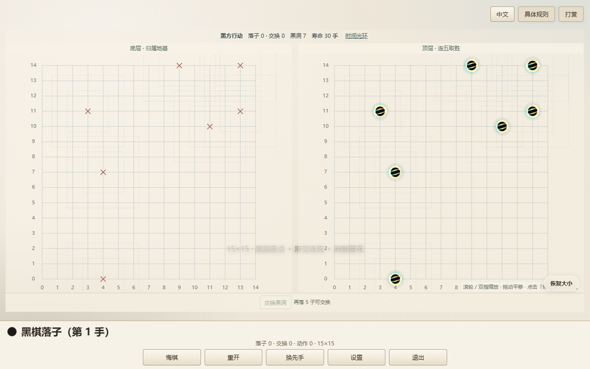
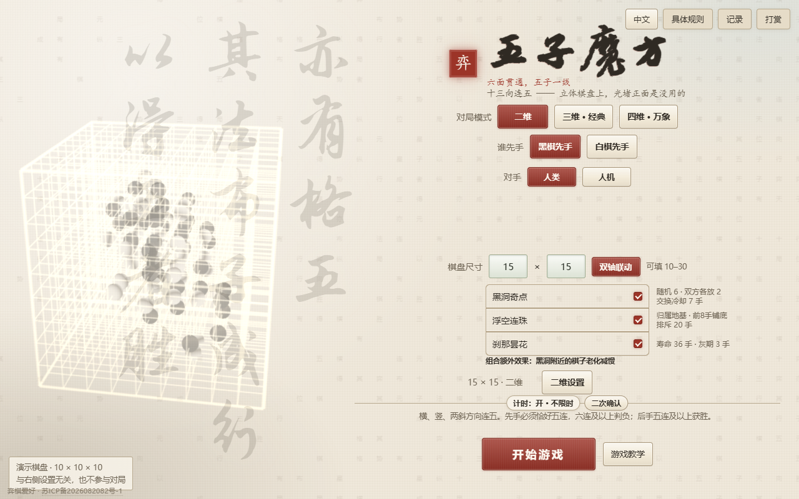

# gomoku-3d-4d

[中文](README.md) | **English**

**2D, 3D & 4D Gomoku** — Gomokube, one HTML file, double-click to play, zero dependencies.
*二维、三维与四维五子棋 —— 五子魔方，单文件网页版，双击即玩，零依赖。*

[](https://awua-dcm.github.io/gomoku-3d-4d/)
[](Web_Gomoku3D/index.html)
[](_verify/run-all.sh)
[](LICENSE)

This repository is the **public offline open-source build**: local play only; it does not include
the online client, server or protocol tests. The online service is deployed separately. The
online demo (GitHub Pages) publishes the very same `Web_Gomoku3D/index.html` — there is no build
step, so the deployed file and the one you double-click are identical; the root `index.html` is
just a redirect. The full offline check is `node _verify/check-2d.mjs`.



## 🧩 2D gameplay (new in v4.0.0)

Pick **2D** on the setup screen to play on a flat board. Besides classic Gomoku, three
mechanics can be enabled independently or in any combination — **eight modes in all**:

| Mechanic | What it does |
|---|---|
| **Black-hole singularity (H)** | Players take turns placing holes before play; once enough moves have passed, swap two rows or two columns. Holes block placement; a swap swallows only the top stone and keeps the foundation |
| **Floating connect (F)** | The first 8 stones build foundations; from the 9th move you may play on top. A foundation belongs to whoever placed it; an opponent's top stone starts a 10–30 move repulsion countdown, and when it reaches zero the foundation is destroyed and the top stone falls to become a new foundation |
| **Fleeting bloom (A)** | A new stone does not age on its own move; every later action advances its life. Grey stones still occupy the point but no longer count for a line. Aging is 0.25 per move in the inner black-hole ring, 0.5 in the outer ring, and 1 elsewhere |

- Boards are rectangles from 10–30 per side; classic defaults to 15×15. The first player must still make **exactly five in a row**; six or more is a loss.
- With black holes and aging both on (H+A, H+F+A), stones near a black hole age more slowly.
- The **2D settings** panel and **Tutorial** appear only when at least one extra mechanic is on; seven tutorial levels cover the three mechanics and four combinations.
- Landscape shows the two boards side by side; portrait stacks them. Scroll or pinch to zoom, drag to pan, double-tap to reset.
- 2D records store the opening layout, hole placements, and move/swap actions; replay them, or export a long image or victory poster. Old 3D/4D records remain readable.



Authoritative rules and mechanic details: [section 13 of the full rules](Web_Gomoku3D/RULES_SPEC.en.md).
This release's summary: [v4.0.0 release notes](RELEASE_NOTES_v4.0.0.md) (Chinese).

---

## 🎯 What this is

Gomoku (five-in-a-row) on an **N×M flat board** or on an **N×N×N board**. The big difference
from the flat game is that there are far more ways to line stones up — **13 directions** in all
(3 axes + 6 face diagonals + 4 body diagonals). Blocking the front is not enough: a line can cut
diagonally, run straight up through the layers, or thread several layers at once.

A few things you don't see every day:

| | |
|---|---|
| **2D mode** | A flat board from 10–30 per side; classic rules plus black holes / floating foundations / aging, in any combination — eight modes |
| **4D mode** | A layer can be **rotated like a Rubik's cube**. Once every few moves you may rotate one layer, and every stone in it moves with it — a threat you set up two moves ago can be rotated right out from under you |
| **Rectangular boards** | In 3D mode the three axes may have different lengths (say `8 × 12 × 30`). Each axis accepts `8 – 30` |
| **The first player is restricted** | 2D, 3D and 4D all require the first player to make **exactly five in a row**; six or more is an **overline loss**. The second player wins with five or more. On a 3D board the first player's advantage would otherwise be overwhelming — see the [full rules](Web_Gomoku3D/RULES_SPEC.en.md) |

---

## 🕹️ How to play

**Double-click `index.html` (or `Web_Gomoku3D/index.html`)** and it opens in any modern browser.

No server, no network, nothing to install.
To confirm nothing is broken: press `F12` → Console and look for red text.

### 🧩 2D

- Pick **2D** on the setup screen, choose the board size, then **Start game**; classic defaults to 15×15.
- The three mechanic checkboxes are stacked and can be combined freely. Ticking one only toggles the mechanic; the centred **2D settings** button opens the parameter panel.
- Landscape: two boards side by side; portrait: stacked. Scroll or pinch to zoom, drag to pan, double-tap to reset.
- The bottom bar keeps Undo, Restart, Swap first player, Settings and Exit; clocks and per-move limits use the same entry points.
- Keyboard: arrow keys move the cursor, `Enter` places a stone, `0` resets the zoom; keys can be changed under **Custom keybindings**.
- After the game, open **History**, expand the move list and press **Replay** to step through it.

### ⌨️ Controls (3D / 4D)

| Action | What it does |
|---|---|
| Drag with the left button | Rotate the board. Left/right turns forever; dragging up/down **all the way gives you a true top-down or bottom-up view** (89.5°). **The board follows your finger**: drag down to look at the top face |
| Drag with the **right** button (or `Shift` + left) | Pan the board: the picture follows your pointer. Same clamping as the touch two-finger pan (at most half a viewport out, at least half the board visible) |
| Scroll wheel / trackpad two-finger | Zoom. **Scroll down = zoom out**, up = zoom in; on a trackpad, fingers apart = zoom in, together = zoom out (both use the same sign) |
| Click | Place a stone on the current layer |
| Hover | Red lines mark the x / y / z lines through the cell under the cursor |
| Right-hand panel | Step through the board layer by layer; click an empty cell to play there |
| **Grid lines** button, top-left | Hide the 3D lattice so only the stones remain. The blue current-layer frame, the red hover lines and the gold winning line all stay — hide those and you cannot aim |
| End-of-game banner | Can be **dragged** (it cannot leave the left-hand view), and closed with **Close Esc** or the Esc key. Closing it does not let you play on: to continue the same game you must press **Undo** |
| `Z` / `R` / `G` | Undo / Restart / Toggle the view mode (ghost layers ↔ slice) |
| `H` | Hide / show the grid lines (same as the top-left button) |
| `Q` `E` or `[` `]` | Change the current layer |
| `T` / `Y` | (4D) Rotate a layer / undo that rotation |
| Touch: pinch in / out | Zoom the board. **Works on both the 3D board and the single-layer board** (on a phone a cell of the layer board is only about 10px across, so zooming is the only way to aim) |
| Touch: two-finger drag | Pan the board — it follows your fingers |
| Language button, top-right | Opens a list of the six languages (中文 / English / 日本語 / 한국어 / Русский / Français); the current one is highlighted |
| **History** button, top-right of the setup screen | The last 50 finished games: summary + full move list (coordinates / colour / time, rotations in 4D). **Hidden during play** — go back to the setup screen to open it; export a long image or a victory poster; **Clear** sits inside |
| Touch: double-tap a board | Reset — the 3D board returns to its start framing, the layer board to 1×, pan cleared. **The angle you rotated to is left alone** |

> While zoomed in, a single tap places its stone after a ~300ms double-tap window.
> **At 1× with no panning there is no such delay** — placing is as immediate as it always was.

The **Full rules** button in the top-right corner opens the complete rule text.

---

## 🧪 Running the tests

```bash
node _verify/check-2d.mjs
```

`bash _verify/run-all.sh` is the same entry point. **All you need is node** — no Unity,
no .NET, no npm packages. The script runs 22 steps: rebuild the 2D source parts, check the
six rule languages, build the kernel and the public build, then run every 3D / 4D / 2D offline
suite, real-browser checks, mobile-viewport checks, keybinding checks and five 2D fault
injections. Logs and the summary land in `_verify/results/`.

Main steps:

| Command | What it covers |
|---|---|
| `node Web_Gomoku3D/tests/rules.test.mjs` | 3D rule baseline (replays frozen vectors) + dawn/dusk phase clock |
| `node Web_Gomoku3D/tests/rotation.test.mjs` | 4D rotation consistency |
| `node Web_Gomoku3D/tests/dims.test.mjs` | Rectangular boards + size constraints |
| `node Web_Gomoku3D/tests/ai.test.mjs` | 3D / 4D computer opponent (five tiers, rotation timing, compute ceiling) |
| `node Web_Gomoku3D/tests/dom-smoke.test.mjs` | DOM stub (six languages, game records, gesture and reset edges) |
| `node Web_Gomoku3D/tests/two-d-rules.test.mjs` | 2D rules, eight combinations, 400-game fixed-seed property test |
| `node Web_Gomoku3D/tests/two-d-ai.test.mjs` | 2D AI forced wins and blocks, eight-combination self-play, compute budget and VCF |
| `node Web_Gomoku3D/tests/two-d-tutorial.test.mjs` | Seven tutorial solutions, undo and unique key swaps |
| `node _verify/browser-check.mjs` | Real browser: GLSL, layout geometry, console errors, six-language sweep |
| `node _verify/two-d-browser.mjs` | 2D in a real browser: placement, swaps, aging, record replay |
| `node _verify/two-d-settings-browser.mjs` | 2D settings, stacked layout, cross-mode title and watermark positions |
| `node _verify/mobile-audit-browser.mjs` | Mobile viewport: start buttons, horizontal overflow, touch cancel and right-click |
| `node _verify/keybindings-browser.mjs` | Custom keybinding draft, confirm and back flow |
| `node _verify/two-d-tutorial-browser.mjs` | Seven tutorial levels, six languages and portrait |
| `node _verify/inject-2d.mjs` | Fault injection: proves the 2D checks can fail (5 cases) |
| `node _verify/kb-links.mjs` | Knowledge-base link check |

Browser checks need Chrome or Edge. `browser-check.mjs` skips when no browser is found;
the 2D browser checks fail outright, because 2D placement, swaps and aging have to be
verified in a real page. They also write screenshots to `_verify/shots/`.

`inject-2d.mjs` temporarily breaks the 2D source and restores it in a `finally` block;
`inject-rulenote.py` / `inject-i18n.py` still cover the rule summary and the language
switch. They run `browser-check` against a scratch directory, so the baseline PNGs in
`_verify/shots/` are never overwritten: screenshots are taken *before* the failures are
reported, so writing to the default directory would put captures of a deliberately broken
page into version control — after which `git status` can no longer tell "the image went
stale" from "the UI really changed".

### 🔒 About the "frozen vectors"

`tests/vectors.json` and `tests/rotation-vectors.json` were **exported from a C# kernel
that has since been deleted**. The export script and the C# source are both gone. That means:

> **Those two files can never be regenerated.**

`_verify/check-public.mjs` pins them by md5. Editing them to make a test go green
**is not fixing a bug, it is tampering with evidence**. What they mean today is
"this implementation agrees move-for-move with the C# one as of 2026-09" — a **frozen
historical baseline**, not a comparison against something still alive.
See [`_verify/check-public.mjs`](_verify/check-public.mjs) for the full story.

---

## 📁 Repository layout

```
.
├── README.md                   ← the Chinese README (this file is README.en.md)
├── index.html                  ← redirects to Web_Gomoku3D/index.html
├── Web_Gomoku3D/
│   ├── index.html              ← all the code. 2D/3D/4D rendering + rule kernel + UI, one file, no dependencies
│   ├── README.md               ← engineering notes: architecture, evidence boundaries, known limits (Chinese only — much deeper than this file)
│   ├── RULES_SPEC.md           ← full rules, for players (Chinese; section 13 covers 2D)
│   ├── RULES_SPEC.en.md        ← the rules in English / Japanese / Korean / Russian / French:
│   ├── RULES_SPEC.ja.md        ←   picking a language shows that language's copy
│   ├── RULES_SPEC.ko.md
│   ├── RULES_SPEC.ru.md
│   ├── RULES_SPEC.fr.md
│   ├── ONLINE.md               ← networking placeholder (the open-source build has no online code)
│   └── tests/                  ← 3D/4D/2D offline tests + the two frozen vector files
├── _verify/
│   ├── check-2d.mjs            ← one command runs every offline check (run-all.sh is the same entry)
│   ├── embed-2d.mjs            ← re-embeds the 2D source parts into index.html
│   ├── embed-rules.mjs         ← generator that embeds all six RULES_SPEC files into index.html
│   ├── browser-check.mjs       ← headless Chrome/Edge: GLSL, console, layout geometry, screenshots
│   ├── two-d-browser.mjs       ← 2D real-browser check
│   ├── two-d-settings-browser.mjs ← 2D settings and stacked-layout check
│   ├── two-d-tutorial-browser.mjs ← seven tutorial levels check
│   ├── mobile-audit-browser.mjs ← mobile viewport and touch check
│   ├── inject-2d.mjs           ← injection check: proves the 2D assertions can fail
│   ├── two-d-*.part.*          ← 2D source parts (re-embed with embed-2d.mjs)
│   └── shots/                  ← screenshots written by the browser checks
├── RELEASE_NOTES_v4.0.0.md     ← v4.0.0 release summary (Chinese)
├── 知识库/                     ← engineering knowledge base (open the repo root in Obsidian)
├── 打开流程.md                  ← setup walkthrough + acceptance checklist (Chinese only)
└── LICENSE
```

### 🧩 A deliberate design choice: one file

The section of `index.html` between `/* GOMOKU-CORE-BEGIN */` and `/* GOMOKU-CORE-END */`
is a **pure rule kernel** — it touches no DOM, no WebGL, no browser API. So the same source
runs in three places:

1. The browser (normal play)
2. Node (`tests/rules.test.mjs` extracts it with `new Function` and replays the vectors)
3. The private online server (as the referee)

**One implementation**, so there is no way for "the web build changed but the server didn't"
to happen.

The 2D part is additionally kept as source parts in `_verify/two-d-core.part.js`,
`two-d-ui.part.js` and friends; after editing them, run `node _verify/embed-2d.mjs` to embed
them back into the same `index.html`. The runtime artefact is still one file.

---

## 🌐 Six languages

The language button in the top-right corner opens a list of six:
**中文 / English / 日本語 / 한국어 / Русский / Français**. Each entry is written in its own
language (an endonym — no letter codes, no flags), and the current one is highlighted.
It **starts in Chinese** — it does not read `navigator.language`. That is switching, not guessing.
The choice is remembered in `localStorage`.

The full rule text exists in all six (`RULES_SPEC.md` / `.en` / `.ja` / `.ko` / `.ru` / `.fr`)
and follows the language you pick. The 2D UI, 2D settings and section 13 of the rules are
translated into all six as well.

Four things worth knowing:

- **The Chinese text stays in the HTML; the other languages live in string tables.** Switching
  back to Chinese writes the original HTML text back, so there is exactly one copy of the
  Chinese — the languages can't quietly drift apart
- **The rule kernel carries six languages too.** The kernel was already building Chinese
  sentences (`黑`/`白`, status descriptions), and there was no way around translating it: it has
  to be extractable verbatim by the private server build and three test files, so it cannot reference an
  outside string table — it keeps its own (`CORE_TEXT`). Called without `lang`, the output is
  byte-for-byte what it always was; the private networking protocol is therefore still Chinese
- **Plurals are chosen per language.** Chinese, Japanese and Korean have none; English and
  French have two forms (French counts 0 as singular); Russian has three (1 / 2–4 / 5+, with
  11–19 falling into the third). The rule lives in exactly one place — inside the kernel,
  because the UI needs it too and the kernel cannot call into the UI
- **Leftover Chinese in a translated UI is guarded by assertions.** `browser-check` sweeps the
  rendered tree screen by screen: any CJK character in the Russian or French UI, any Chinese
  character run that is **not part of that language's own translations** in the Japanese or
  Korean UI, and any leaked key name — all of those fail the check

> On translation quality: every string and all six rule documents were checked
> string-by-string for placeholders, HTML tags and structure — but **"does it read naturally"
> is not something an assertion can prove**. Where the six disagree, the Chinese is the source
> of truth.

### 📚 Which documents are English?

The player-facing material is bilingual: this README, the full rules (`RULES_SPEC.en.md`),
and the whole interface. The **deep engineering documentation is Chinese only** —
`Web_Gomoku3D/README.md` (architecture, evidence boundaries, the reasoning behind each design
decision), `打开流程.md`, and `ONLINE.md`. That is a real gap for English-speaking contributors,
and it is stated here rather than papered over.

---

## ☕ Tip the author

The game is free forever — **no membership, no paywalled features** (the membership entry has been removed). If it gave you a good time, you can leave a voluntary tip; everything works without it. The Tip button sits top-right.

You can also support on Afdian: [afdian.com/a/awuadcm666](https://afdian.com/a/awuadcm666)

<table>
  <tr>
    <td align="center">Alipay<br></td>
    <td align="center">WeChat<br></td>
  </tr>
</table>

> Tips are voluntary and unlock nothing. Minors should ask a guardian first.

---

## ⚠️ Known limitations

- **The computer opponent is not an engine.** Five tiers (Low / Mid / High / Extra high / Ultra) differ
  in how far they look, whether they run a **kill search** (forced-win search: runs of fours, and runs
  of open threes), and how they decide whether to rotate in 4D. Threat counting uses a sliding window,
  so **it does recognise gapped shapes and double threats**; but it has no opening book, no joseki and
  no quiescence search — good enough as a sparring partner; for a serious game, use a dedicated engine.
- **2D combination strength is not accepted at tournament level.** Forced wins, forced blocks,
  legal moves and the compute budget are verified; how strong the black-hole / floating / aging
  combinations are in practice is still a matter of playtesting.
- **No saved games.** There is a "Game records" list, now storing a summary plus the full move
  list (coordinates / colour / time per move, rotations in 4D and hole placements / swaps in 2D);
  you can expand it and export a long image or a victory poster. **It still cannot bring a game
  back**: closing the page mid-game ends it.
- The 3D grid lines have **no sense of depth**: looking through the cube stacks n parallel
  grid lines at exactly the same screen position, and since they are alpha-blended the inside
  reads as a gray mesh. This is inherent to drawing coincident primitives — adjusting alpha only
  makes it uniformly fainter. Real depth needs `depthMask = true` in `draw3D`, at the cost of
  barely being able to see inside when looking straight down an axis
- On very full boards (more than 4000 stones) the **thumbnail degrades into an occupancy bar**
- Coordinate picking on rectangular boards falls back to "ray × current layer plane", so
  looking exactly edge-on at the current layer makes depth ambiguous
- **In a narrow window with a long game name, the title slides under the two fixed keys**
  (language / full rules) in the top-right corner: at 900×700 every one of the six languages has
  the end of its title covered (measured: English loses "ube", French five characters). The title
  is only capped by viewport width (`min(81px, 7.8vw)`) and does not step aside for those two
  keys — shrinking it until they no longer overlap would take it down to about 40px at 900 wide,
  which is a typographic trade-off rather than a plain bug fix. No overlap from 1600×900 up.
  (The two title problems fixed in v3.1.7 were horizontal overflow and the Japanese title
  wrapping onto two lines.)
- **The 4D summary box clips its last line in en / fr / ru**: the box has a fixed height of
  84px (88px in English) while those three 4D paragraphs wrap to 6–7 lines at 640px wide
  (measured 123px — two lines more than Chinese). An inner scrollbar appears; scrolling reveals
  the rest. Letting the box grow to fit breaks the pinned invariant "switching 3D↔4D must not move
  the buttons by a single pixel" (measured: it moved them 4–34px), so it stays as is — fixing it
  properly means cutting copy or paying for the height elsewhere, which is a layout decision.
- **Mobile validation uses desktop Chromium viewports and simulated touch events.** It has not
  been verified on a physical iPhone Safari, an in-app WeChat browser or a weak network; real
  feel still needs a phone.

A more complete list (including which claims are verified and which are merely my belief)
is in [Web_Gomoku3D/README.md](Web_Gomoku3D/README.md) — in Chinese.

---

## 📝 Changelog

> Newest first. One line per version, starting with a verb; the implementation details live in the commit message, not here.

### 2026.11.02

- ✨ **v4.0.0** Added 2D gameplay: the setup screen now offers **2D**, with rectangular flat boards from 10–30 per side (classic defaults to 15×15), so players who find the 3D board hard to visualise can start here; 3D and 4D remain, and all three modes share game records, replay, long images and victory posters. It adds **black-hole singularity** (players take turns placing holes; after enough cooldown moves, swap two rows or two columns; only the top stone at the destination is swallowed, foundations stay), **floating connect** (the first 8 stones build foundations; from the 9th move you may play on top; a foundation belongs to its owner, and an opponent's top stone starts a 10–30 move repulsion countdown that destroys the foundation and drops the top stone into a new one) and **fleeting bloom** (a new stone does not age on its own move; every later action advances its life; grey stones still occupy the point but no longer count for a line); the three can be enabled independently or in any combination — eight modes in all, with black holes and aging both on making stones near a black hole age more slowly; the 2D settings panel and tutorial appear only when an extra mechanic is on, and seven tutorial levels cover the three mechanics and four combinations. The 2D interface shows two boards side by side in landscape and stacked in portrait, with scroll / pinch zoom, drag pan and double-tap reset; the settings panel shows only the selected mechanics' parameters with their ranges, and closes on outside click, `Esc` or **Close Esc**. It also adds custom keybindings for placement, rotation and UI shortcuts with independent draft / confirm / back validation; fixes hover movement without a pressed button being recorded as a second finger in 3D/4D, gestures surviving touch cancel and backgrounding, right-click placing a stone in 2D, the previous language's toast lingering after a language switch, and the 3D/4D placement area being too small in phone portrait; and extends verification with 2D rules and a 400-game fixed-seed property test, AI forced wins / blocks / budget, seven tutorial levels, six languages and mobile viewports, real-browser checks and five 2D fault injections, while the existing 3D/4D suites remain green.

### 2026.10.26

- 🔧 **v3.2.1** Fixed 4D day/night "Haste" losing its overflow time when only one cell was left in the phase: a full cycle is no longer one move longer (always 2 × period); 15 phase-clock regression assertions added.

### 2026.10.24

- ✨ **v3.2.0** Game-screen, clock and online update: flat-shaded stones, five bottom keys with board-appearance settings, millisecond clocks (local clock option / online per-move limit), online start confirmation and emoji; fixed the preview pan and LAN room-code copy.

### 2026.10.22

- ✨ **v3.1.11** Membership removed and entries reorganized (Human hides thinking level / who plays first; online builds put the Online button there; History/Membership/Online hidden in play); new full move record, victory poster and long-image export (both show the difficulty ladder; Ultra gets an exclusive badge), with a nickname dialog before export; the tip panel now shows Alipay/WeChat QR codes and the Afdian link; mobile export uses the share sheet so the image is easy to save.

### 2026.10.21

- ✨ **v3.1.10** Added a web app icon and a **Tip** entry top-right (Alipay/WeChat QR codes + Afdian); tipping changes nothing.
- ✨ **v3.1.9** Public release cleanup: the repository and the public distribution contain the single-player game only.

### 2026.10.14

- ✨ **v3.1.8** Game records plus a gameplay audit: each finished game leaves a one-line summary (last 50; undoing back into the game removes its line), two 4D-vs-computer bugs fixed, and the rules text now matches the implementation.

### 2026.10.09

- 🔧 **v3.1.7** Fixed a batch of issues found by testing, ordered by whether a player can
  feel them: UI state (particle ghosts, the rotation-preview/restart fork, `R` in a tutorial,
  an unbanner that would not go away), an interaction deadlock, layout overflow on narrow and
  phone-landscape screens, English plurals and four copy statements that contradicted the
  implementation, three rules-kernel verdicts (overline scan order, wrap double-counting,
  winning-line coordinates), and four robustness fixes in the online server; details in the commits.

### 2026.10.06

- ✨ **v3.1.6** Visual overhaul plus a new interaction: renamed to **Gomokube** across all six
  languages, and the start screen restyled — rice-paper ground, bamboo/jade controls, a
  running-script brush title (inlined font subset, 5.5 KB, single-file premise kept) and a vertical
  classical-Chinese watermark; behind it all, a character-particle layer scatters away from the
  cursor and springs back, denser on the right, and stops its rAF entirely once at rest

### 2026.10.01

- 🔧 **v3.1.5** Various fixes

### 2026.09.30

- 🔧 **v3.1.4** Verification gaps closed: three invariants that only a throwaway probe was watching
  are now in the real suites — canvas bitmap sizing, the phase halo (one check for the 2D panel's
  pixels, one for the 3D instance count) and self-play under wrapping; the first halo check was a
  **false test** (it only covered the 2D pass, and stayed green with the 3D pass removed)
- 🔧 **v3.1.3** Various fixes
- ✨ **v3.1.2** Wrapping joins the game for real: the 4D mode "4D · Myriad" turns all three on at once
  (Rubik rotation / space wrapping / day and night); 3D gains two checkboxes — "Rubik rotation" and
  "Space wrapping" — tick whichever you want (neither is ticked by default; unticked is plain 3D)
- ✨ **v3.1.1** Day and night now show the phase with a **halo**: a thin ring around every stone,
  pale red for day and pale blue for night — both phases are drawn equally clearly instead of
  being told apart by opacity
- ✨ **v3.1.0** Wrapping is **now visible**: the ring of cells hugging the outside of the board
  draws **shadows** of the stones on the boundary — a line leaving the right edge shows its
  continuation one cell past it, so a five across the seam no longer has to be imagined
- 🔧 **v3.0.1** Various fixes

### 2026.09.29

- ✨ **v3.0.0** New 4D mechanics: **wrapping** (the six faces are joined, so a five may cross an
  edge), **day / night** (the board alternates phase and only lines of the current phase count; a move
  may declare "hold" to stall the clock or "hasten" to push it — borrowed time is repaid out of the
  next phase, so you can only shift it, never create it) and a **phase timeline** below the flat board
  (one column per move, the background shows the phase); plus a **tutorial** whose three levels cover
  rotation, wrapping and day / night
- 🎨 **v2.10.17** Setup screen: the mode bar is now two rows (how to look / whom to show); rotation
  cooldown becomes a typed number like the board size (3 – 10), and the freed row goes to the new
  "phase length" (10 – 30); at Ultra the slider shifts up a few pixels with a small note below it
- ✨ **v2.10.16** Computer opponent: 4D rotation now competes with placing a stone (same search,
  higher score wins); Ultra gains a kill search over open threes (VCT); added a Zobrist table
- 🔧 **v2.10.15** Board size upper limit lowered from 50 to 30 (`8 – 30`)

- ✨ **v2.10.14** Stronger computer opponent: fixed "its second stone wanders off to the player's
  layer"; the leaf evaluation adds the two best threats; Extra high goes to 5 plies and Ultra deepens
  iteratively; the kill search stops missing one case

### 2026.09.28

- 🎨 **v2.10.13** Reworked the start-screen background: the light is staged again so the demo board's lower edge no longer dissolves into the paper (the two washes used to sit on different light paths, so the page read flat and a near-white wireframe on an equally bright sheet had no structure); the vermilion seal now carries a soft glow as the page's single point of light

### 2026.09.27

- 🐛 **v2.10.12** Various fixes
- 🎨 **v2.10.11** 4D rotation panel: "Confirm" and "Cancel" are now permanent — greyed out and inert until you press "Rotate", when they light up with a ring. The "Restore rotation" button is gone (that slot now holds these two); use Undo or the `Y` key for the same thing.
- ✨ **v2.10.10** Rotating a layer in 4D is now two steps: "Rotate" first **turns the board so you can see it** (no turn used, not counted as a move); the two buttons then become "Confirm" and "Cancel" with a highlighted ring, and only "Confirm" makes it real. No placing stones during the preview.
- 🎨 **v2.10.9** Colour tweaks: ghost-layer stones are a shade deeper, and the 3D static grid is now a greyer, paler tone (it used to be a warm brown that read as too loud once a whole board was covered); in 4D the computer no longer rotates layers constantly — it rotates only when that genuinely breaks up an open three or better, and its 4D search now goes deeper
- 🐛 **v2.10.8** Various fixes
- 🐛 **v2.10.7** Various fixes
- 🎨 **v2.10.6** Start screen: in all six languages the row labels share one column width and the buttons have a uniform minimum width, so every row lines up; the column was tightened to keep "Start game" above the fold
- 🎨 **v2.10.5** Start screen: the strength slider is centred; with "Human" selected it is now dimmed and non-interactive rather than hidden (the same treatment the rotation-cooldown buttons get in 3D mode)
- 🎨 **v2.10.4** Start screen: the strength slider now sits on its own row below the Human / Computer switch, and the two buttons are centred
- 🐛 **v2.10.3** The strength slider is now genuinely draggable (a native range input, square corners like every other button) and its fill deepens one step per level; the opponent row is now a Human / Computer switch, with the slider appearing only once you pick the computer; all six languages updated
- ✨ **v2.10.2** The computer opponent is now a five-stop slider (Low / Mid / High / Extra high / Ultra); replaced the evaluation (threat counting per direction, gapped shapes and double threats); the top tier adds a kill search (forced runs of fours)

- ✨ **v2.10.1** The medium and hard tiers now search: medium looks one reply ahead, hard four plies; fixed moves outside the hard tier's win/block path never being sorted (all three tiers played near-randomly on most turns)
- ✨ **v2.10.0** Added a computer opponent: easy / medium / hard on the start screen; in 4D it rotates layers too
- 🐛 **v2.9.1** Desktop: right-drag (or Shift + left-drag) now pans the 3D board; fixed the trackpad pinch zooming the wrong way (the mouse wheel direction was wrong too)

### 2026.09.26

- 🐛 **v2.9.0** Four phone fixes: setup-screen buttons overlapped, "White only" slid off the screen, the vertical drag moved against your finger, and the language button now reads 中文
- 🌐 **v2.8.0** Added Japanese, Korean, Russian and French: six UI languages, four more full rule translations, plurals chosen per language (three forms in Russian)
- 🐛 **v2.7.4** Fixed zooming on phones: pinch to zoom and pan, double-tap to reset
- 🎨 **v2.7.3** Moved the language and rules buttons to the top-right of the setup screen
- 🐛 **v2.7.2** Fixed misplaced buttons in the English portrait layout

### 2026.09.25

- 🐛 **v2.7.1** Various fixes
- 📱 **v2.7.0** Added portrait support — playable in a phone or tablet browser
- ✨ **v2.6.0** Added the "black only / white only" buttons

### 2026.09.24

- ✨ **v2.5.0** Added the grid-lines switch, which hides the 3D lattice
- 🌐 **v2.4.0** Added the English / Chinese switch
- 🐛 **v2.3.2** Various fixes; published the project on GitHub
- 🎨 **v2.3.1** Moved the buttons on the setup screen
- 🎨 **v2.3.0** Reworked the setup screen so it no longer feels split in two
- 📝 **v2.2.1** Revised the rule text
- ✨ **v2.2.0** Added the rules overlay in the top-right corner
- 🎨 **v2.1.0** Adjusted the game screen and a few details
- ✨ **v2.0.0** Added 4D mode: the board can be rotated like a Rubik's cube (more gameplay to come)

### 2026.09.23

- 🐛 **v1.1.1** Various fixes
- ✨ **v1.1.0** Added the hover lines that mark a cell
- 🐛 **v1.0.1** Various fixes
- 🎉 **v1.0.0** First working 3D gomoku prototype

---

## 📄 License

[MIT](LICENSE)
