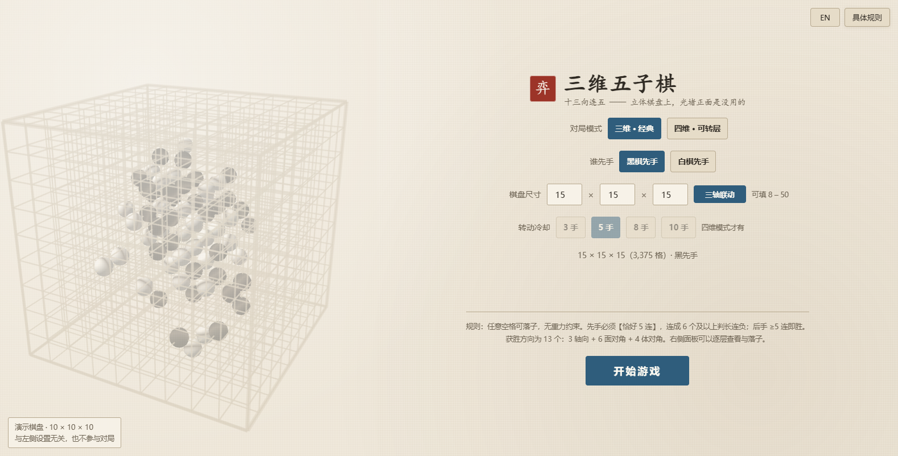

# gomoku-3d-4d

**三维与四维五子棋** —— 单文件网页版，双击即玩，零依赖。
*3D & 4D Gomoku in a single HTML file. No build step, no server, no dependencies.*



---

## 这是什么

在 **N×N×N 的立体棋盘**上下五子棋。和平面五子棋最大的不同是"直线"变多了 ——
一共 **13 个方向**（3 轴向 + 6 面对角 + 4 体对角），所以光堵住正面是没用的：
斜着穿、竖着穿、甚至穿过好几层，都可能是杀招。

三个比较少见的地方：

| | |
|---|---|
| **四维模式** | 棋盘可以像魔方一样**转层**。每落几手可以转一层，转完之后位置关系全变 —— 上一手做的威胁可能直接被转走 |
| **长方体棋盘** | 三维模式下三个轴可以填成不等长（例如 `8 × 12 × 30`），棋盘尺寸范围 `8 – 50` |
| **先手受约束** | 先手方必须**恰好 5 连**，连成 6 个及以上判**长连负**；后手方 ≥5 连即胜。原因是立体棋盘上先手优势过大，见 [规则说明](Web_Gomoku3D/RULES_SPEC.md) |

---

## 怎么玩

**双击 `Web_Gomoku3D/index.html`**，用任意现代浏览器打开。

不需要服务器、不需要联网、不需要装任何东西。
想确认没报错：按 `F12` → Console 标签，看有没有红色文字。

### 操作

| 操作 | 说明 |
|---|---|
| 左侧按住左键拖拽 | 旋转棋盘 |
| 滚轮 | 缩放 |
| 单击 | 在当前层落子 |
| 鼠标悬停 | 红线标出落点的 x / y / z 三条贯穿线 |
| 右侧面板 | 逐层查看盘面，点空格子直接落子 |
| `Z` / `R` / `G` | 悔棋 / 重开 / 切换视图模式（幽灵层 ↔ 切片） |
| `Q` `E` 或 `[` `]` | 切换当前层 |
| `T` / `Y` | （四维）执行转动 / 恢复本次转动 |

右上角「具体规则」有完整规则全文。

---

## 跑测试

```bash
bash _verify/run-all.sh
```

**只要装了 node 就能跑**（不需要 Unity、不需要 .NET、不需要任何 npm 包）。
八步，期望结果：

```
11733 + 19408 + 98 + 53 + 8845 + 115 + 63 = 40315 项断言全绿
```

第 8 步（真实无头浏览器检查）是可选的：本机没装 Chrome/Edge 会自动跳过，不算失败。
它会顺带截图到 `_verify/shots/`。

单跑某一项：

| 命令 | 项数 | 覆盖 |
|---|---|---|
| `node Web_Gomoku3D/tests/rules.test.mjs` | 11733 | 三维规则基线（回放冻结向量） |
| `node Web_Gomoku3D/tests/rotation.test.mjs` | 19408 | 四维转动一致性 |
| `node Web_Gomoku3D/tests/dims.test.mjs` | 98 | 长方体棋盘 + 尺寸约束 |
| `node Web_Gomoku3D/tests/dom-smoke.test.mjs` | 53 | 界面桩环境 |
| `node _verify/browser-check.mjs` | 63 | 真实浏览器（GLSL 编译、布局几何、控制台报错） |

### 关于"冻结的向量"

`tests/vectors.json` 和 `tests/rotation-vectors.json` 是**从一份已经删除的 C# 内核导出的**，
导出脚本和 C# 源码本身都已不存在。这意味着：

> **这两个文件永远无法重新生成。**

`run-all.sh` 第 2 步用 md5 把它们钉死。为了让测试变绿而改动它们**不是修 bug，是篡改证据**。
它们现在的含义是"和 2026-09 那份 C# 实现逐手一致"，是一份**冻结的历史基线**，
而不是和某个活的对照物的对拍。详见 [`_verify/run-all.sh`](_verify/run-all.sh) 文件头。

---

## 目录结构

```
.
├── Web_Gomoku3D/
│   ├── index.html              ← 全部代码。三维/四维渲染 + 规则内核 + 界面，单文件零依赖
│   ├── README.md               ← 工程细节：架构、证据边界、已知限制（比这份深入得多）
│   ├── RULES_SPEC.md           ← 玩家向的规则全文。页面上「具体规则」显示的就是它
│   ├── ONLINE.md               ← 双人联机的方案设计
│   └── tests/                  ← 离线测试 + 两份冻结的向量
├── _verify/
│   ├── run-all.sh              ← 一条命令跑完全部离线验证
│   ├── browser-check.mjs       ← 无头 Chrome/Edge：GLSL、控制台、布局几何、截图
│   ├── embed-rules.mjs         ← 把 RULES_SPEC.md 嵌进 index.html 的生成器
│   └── shots/                  ← browser-check 的截图
├── 打开流程.md                  ← 上手流程 + 验收清单
└── LICENSE
```

### 一个刻意的设计：单文件

`index.html` 里被 `/* GOMOKU-CORE-BEGIN */` 和 `/* GOMOKU-CORE-END */` 夹住的那一段是
**纯规则内核**——不引用任何 DOM / WebGL / 浏览器 API。所以同一份源码可以在三种地方跑：

1. 浏览器里（正常玩）
2. Node 里（`tests/rules.test.mjs` 用 `new Function` 抽出来，回放向量）
3. 将来做联机时的服务器（当裁判）

**只有一份实现**，不存在"网页版改了、服务器忘了改"这种分叉。

---

## 已知限制

- **没有电脑对手。** 只能两个人轮流在同一台设备上走（联机功能见 [ONLINE.md](Web_Gomoku3D/ONLINE.md)，尚未实现）
- **没有存档。**
- 三维格线**没有深度感**：视线穿过立方体会叠上 n 层屏幕位置完全重合的平行格线，
  而格线是 alpha 混合画的，累积下来内部会读成一片灰网。这是叠同位置图元的固有问题，
  调 alpha 只能整体变淡、消不掉。想要深度感要把 `draw3D` 里的 `depthMask` 改成 `true`，
  代价是视线正对轴向时几乎看不见内部
- 棋盘很大时（≥ 4000 颗子）**缩略图退化成占用条**
- 长方体棋盘上的坐标拾取退化为"射线 × 当前层平面"，正好侧视当前层时无法判断深度

更完整的清单（含"哪些是验证过的、哪些只是我认为对"）在 [Web_Gomoku3D/README.md](Web_Gomoku3D/README.md)。

---

## 许可

[MIT](LICENSE)
